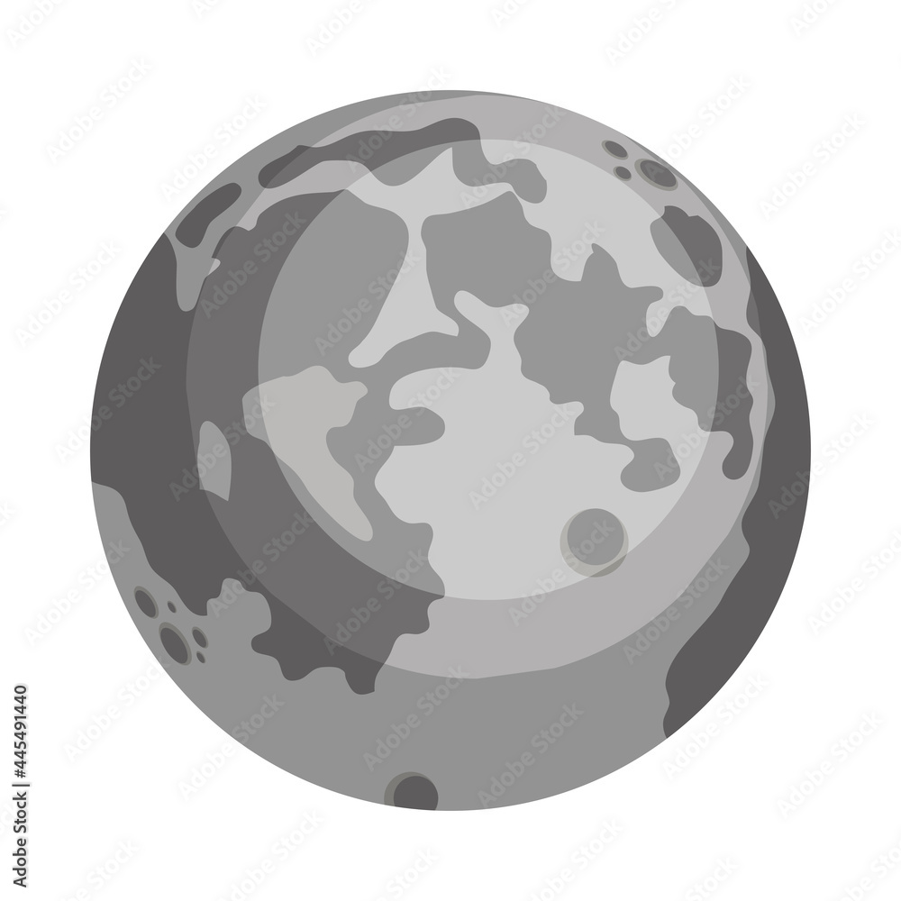

# Pluton

Pluton est une planète naine, la plus volumineuse connue dans le Système solaire

Icone créée par [monkik](https://www.flaticon.com/authors/monkik) trouvée sur [flaticon](https://www.flaticon.com/).

## Caractéristiques

- Masse : (1,314 ± 0,018) x 1022 kg
- Distance au soleil :
  - Aphélie : 7 375 927 931 km
- Périhélie : 4 436 824 613  km
- Demi-grand axe : 5 900 898 440,583 108 67 km
